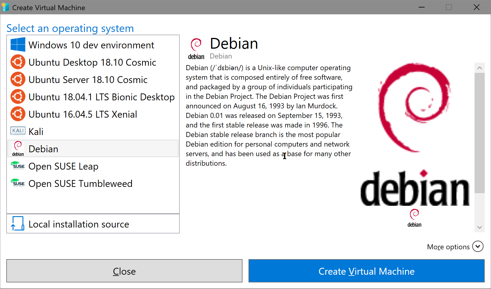

# Custom Quick Create Gallery on Windows 10

In this repository went with some Linux flavors i use regularly Debian, Kali, and Ubuntu.  

## Get the Link or download the Desired OS

### Media

Either an ISO from the OEM or a reputable source, the image must have a file hash, if this does not match the image installations will fail. 

- [Ubuntu](http://cdimage.ubuntu.com)
- [Debian](http://cdimage.debian.org)
- [Kali Linux](https://www.kali.org/downloads/)

or Create a Virtual Machine make sure of 3 things

1. Create the VM as Generation 2
1.  Get the File Hash 
```powershell
Get-FileHash -Path C:\Path\SomeVhd.vhdx -Algorithm SHA256
```
3.  Get the File Data, for the last updated property
```powershell
Get-Date -UFormat "%Y-%m-%dT%TZ" | clip.exe
```

## Prepare the JSON file 

```json
{
  "images": [
      {
      "name": "Debian",
      "version": "1.0",
      "locale": "en-us",
      "publisher": "Debian",
      "lastUpdated": "2018-09-08T08:31:00:00",
      "description": [
        "Debian (/ˈdɛbiən/) is a Unix-like computer operating system that is composed entirely of free software, and packaged by a group of individuals participating in the Debian Project. The Debian Project was first announced on August 16, 1993 by Ian Murdock. Debian 0.01 was released on September 15, 1993, and the first stable release was made in 1996. The Debian stable release branch is the most popular Debian edition for personal computers and network servers, and has been used as a base for many other distributions. "
      ],
      "disk": {
        "uri": "https://cdimage.debian.org/debian-cd/current/amd64/iso-cd/debian-9.5.0-amd64-xfce-CD-1.iso",
        "hash": "sha256:e3934b8dd67f31622f8d2bdb72e91d458c05b05d59b069695274c5cb617e821c"
      },
      "logo": {
        "uri": "https://github.com/smrtRock/CodeSamples/raw/master/QuickCreateGallery/Icons_and_Logos/Debianopenlogo-100.png",
        "hash": "sha256:BDFC92B4D89E37681003A7CC34BD7A0B3FC2AAB780FE523F05B355BF25ABB335"
      },
      "symbol": {
        "uri": "https://github.com/smrtRock/CodeSamples/raw/master/QuickCreateGallery/Icons_and_Logos/Debianopenlogo-100.png",
        "hash": "sha256:BDFC92B4D89E37681003A7CC34BD7A0B3FC2AAB780FE523F05B355BF25ABB335"
      },
      "thumbnail": {
        "uri": "https://github.com/smrtRock/CodeSamples/raw/master/QuickCreateGallery/Icons_and_Logos/Debianopenlogo-100.png",
        "hash": "sha256:BDFC92B4D89E37681003A7CC34BD7A0B3FC2AAB780FE523F05B355BF25ABB335"
      }
    }
    ]
}
```
[Here is the official Link from MS](https://docs.microsoft.com/en-us/virtualization/hyper-v-on-windows/user-guide/custom-gallery)

## Add the Gallery Registry Value

```Powershell
[string[]]$gallerylocations = (
    # Official Windows 10 developer images
    "https://go.microsoft.com/fwlink/?linkid=851584",
    # Custom images
    "https://github.com/smrtRock/CodeSamples/raw/master/QuickCreateGallery/Gallery_Web.json"
    )
$registrypath = "HKLM:\SOFTWARE\Microsoft\Windows NT\CurrentVersion\Virtualization"

Set-ItemProperty -Path $registrypath -Name GalleryLocations -Value $gallerylocations
```

> Results should look something like this

Have Fun
